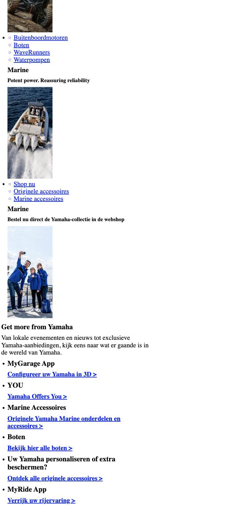
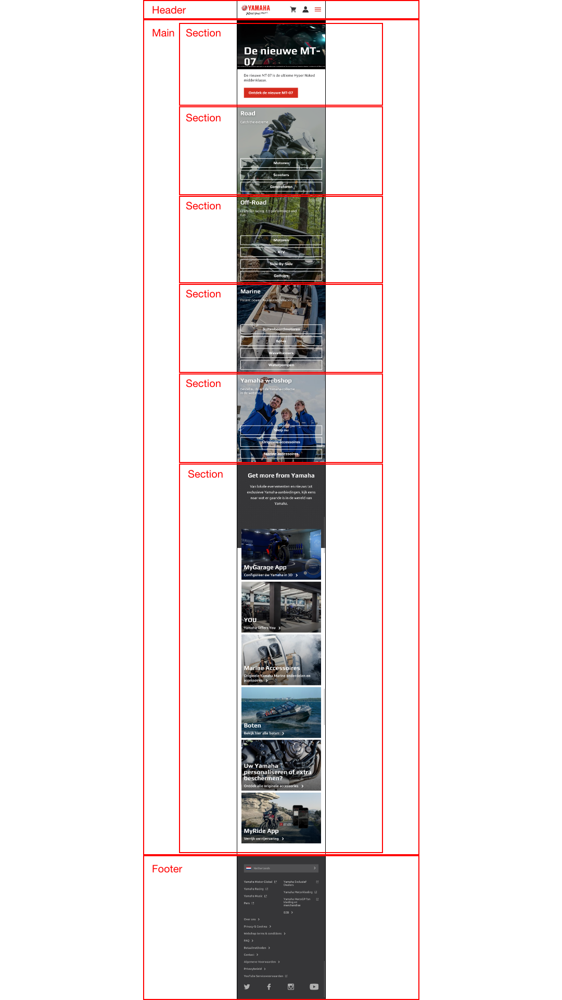

# Procesverslag
**Auteur:** Tim van der Ham (500827229).

Markdown cheat cheet: [Hulp bij het schrijven van Markdown](https://github.com/adam-p/markdown-here/wiki/Markdown-Cheatsheet). Nb. de standaardstructuur en de spartaanse opmaak zijn helemaal prima. Het gaat om de inhoud van je procesverslag. Besteedt de tijd voor pracht en praal aan je website.

## Bronnenlijst
1. -bron 1-
2. -bron 2-
3. -...-

## Eindgesprek (week 7/8)

-dit ging goed & dit was lastig-

**Screenshot(s):**

-screenshot(s) van je eindresultaat-

## Voortgang 3 (week 6)

-same as voortgang 1-

## Voortgang 2 (week 5)

-same as voortgang 1-

## Voortgang 1 (week 3)

### Stand van zaken

Het was makkelijk om alle code over te nemen, maar het kostte erg veel tijd.
Ik had soms problemen met het opslaan van de foto's, dus dat kostte ook erg veel tijd.

**Screenshot(s):**

### Agenda voor meeting

**Stijn:** 
1. Hoe maak je een oneindige loop van fotos horizontaal? 
1. Hoe zorg je ervoor dat fotos na 5 sec veranderen incl. tekst?

**Sara**
1. Wanneer gebruik ik te veel classes? 
1. Is het aantal wat ik heb te veel?

**Tim**
1. Hoe maak je een dropdown met transition die over andere tekst heen valt?
1. Hoe maak je een dropdown navigatie, die navigeert naar content op dezelfde pagina?
1. Hoe kan ik zien welke icon (i element) er word gebruikt?
1. Wanneer gaan we meer horen over het creëren van een hamburger menu?

**Zain**
1. Gebruik ik teveel div's?

### Verslag van meeting
**Antwoorden op mijn vragen:**

1. Opzoeken op internet.
1. Gebruik maken van id's.
1. Font Awesome gaan gebruiken.
1. In een van de komende lessen.

## Breakdownschets (week 1)

## Intake (week 1)
**Je startniveau:** Rood.

**Je focus:** Surface layer.

**Je opdracht:** (https://www.yamaha-motor.eu/nl/nl/ "Yamaha motors")

**Screenshot(s) van de eerste pagina (small screen --> Iphone X):**

**Screenshot(s) van de tweede pagina (small screen --> Iphone X):**

